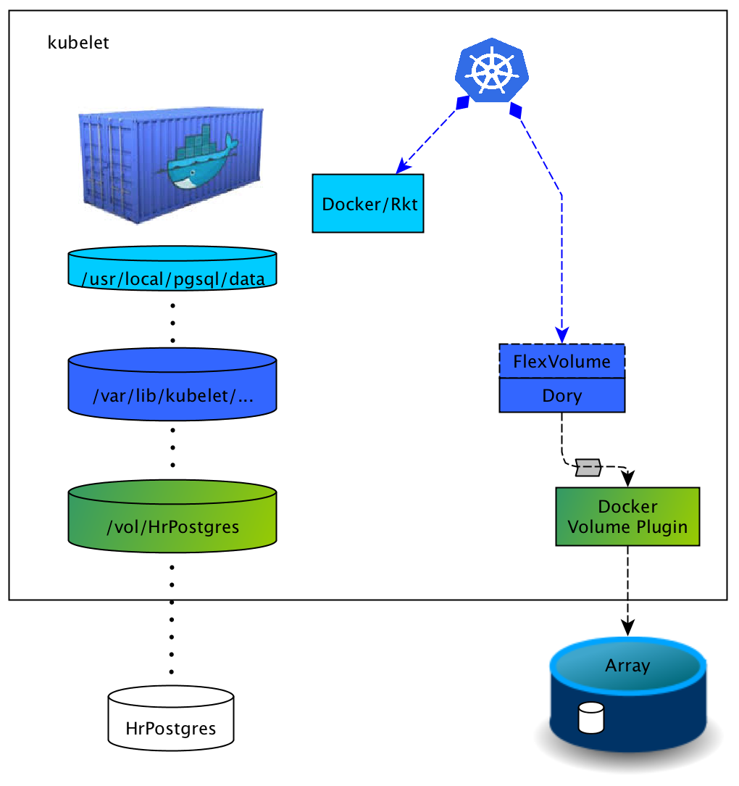

!!! error "Expired content"
    The documentation described on this page may be obsolete and contain references to unsupported and deprecated software. Please reach out to your HPE representative if you think you need any of the components referenced within.

# Introduction
The [Open Source project Dory](https://github.com/hpe-storage/dory) was designed in 2017 to transition Docker Volume plugins to be used with Kubernetes. Dory is the shim between the FlexVolume exec calls to the Docker Volume API.

The main repository is not currently maintained and the most up-to-date version lives in the [HPE Volume Driver for Kubernetes FlexVolume Plugin](https://github.com/hpe-storage/flexvolume-driver) repository where Dory is packaged as a privileged DaemonSet to support HPE storage products. There may be other forks associated with other Docker Volume plugins out there.

!!! hint "Why is the driver called Dory?"
    Dory [speaks whale](https://www.youtube.com/watch?v=jJGeeryk0Eo)!

# Dynamic Provisioning
As the FlexVolume Plugin doesn't provide any dynamic provisioning, HPE designed a provisioner to work with Docker Volume plugins as well, Doryd, to have a complete solution for Docker Volume plugins. It's run as a Deployment and monitor PVC requests.

# FlexVolume Plugin in Kubernetes
According [to the Kubernetes SIG storage community](https://github.com/kubernetes/community/blob/master/sig-storage/volume-plugin-faq.md#working-with-out-of-tree-volume-plugin-options), the FlexVolume Plugin interface will continue to be supported.

# Move to CSI
HPE encourages using the available CSI drivers for Kubernetes 1.13 and newer where available.
