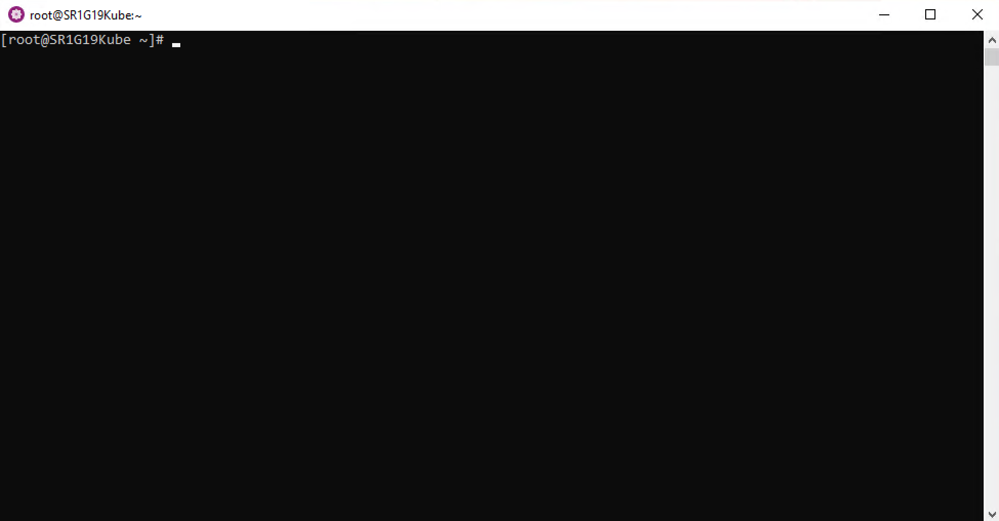

## Lab 1: Tour your cluster

All of this information presented here is taken from the official documentation found on [kubernetes.io/docs](https://kubernetes.io/docs/).

### Overview of kubectl

The Kubernetes command-line tool, `kubectl`, allows you to run commands against Kubernetes clusters. You can use `kubectl` to deploy applications, inspect and manage cluster resources, and view logs. For a complete list of `kubectl` operations, see [Overview of kubectl](https://kubernetes.io/docs/reference/kubectl/overview/) on kubernetes.io.

For more information on how to install and setup `kubectl` on Linux, Windows or MacOS, see [Install and Set Up kubectl](https://kubernetes.io/docs/tasks/tools/install-kubectl/) on kubernetes.io.

### Syntax
Use the following syntax to run `kubectl` commands from your terminal window:

`kubectl [command] [TYPE] [NAME] [flags]`

where `command`, `TYPE`, `NAME`, and `flags` are:

* `command`: Specifies the operation that you want to perform on one or more resources, for example create, get, describe, delete.

* `TYPE`: Specifies the resource type. Resource types are case-insensitive and you can specify the singular, plural, or abbreviated forms. For example, the following commands produce the same output:

* `NAME`: Specifies the name of the resource. Names are case-sensitive. If the name is omitted, details for all resources are displayed, for example `kubectl get pods`.

Get object example command: 
```markdown
kubectl get nodes
kubectl get node <node_name>
```

Describe object example command:
```markdown
kubectl describe node <node_name>
```

Create object example command
```markdown
kubectl create -f <file_name or URL>
```

The below YAML declarations are meant to be created with `kubectl create`. Either copy the content to a file on the host where `kubectl` is being executed, or copy & paste into the terminal, like this:

```markdown
kubectl create -f- (press Enter)
< paste the YAML >
(CTRL-D for Linux) or (^D for Mac users)
```

!!! note "Kubernetes Cheat Sheet"
    Find more available commands at [Kubernetes Cheat Sheet](https://kubernetes.io/docs/reference/kubectl/cheatsheet/) on kubernetes.io.

### Getting to know your cluster:

Let's run through some simple `kubectl` commands to get familiar with your cluster.

First we need to open a terminal window, the following commands can be run from a Windows, Linux or Mac. In this guide, we will be using the Window Subsystem for Linux (WSL) which allows us to have a Linux terminal within Windows.

To start a WSL terminal session, click the CentOS icon in the Windows taskbar.


It will open a terminal window. We will be working within this terminal through out this lab.



In order to communicate with the Kubernetes cluster, `kubectl` looks for a file named config in the `$HOME/.kube` directory. You can specify other `kubeconfig` files by setting the `KUBECONFIG` environment variable or by setting the `--kubeconfig` flag.

You will need to request the `kubeconfig` file from your cluster administrator and copy the file to your local `$HOME/.kube/` directory. You may need to create this directory.

Once you have the `kubeconfig` file, you can view the config file:

```markdown
kubectl config view
```

Check that `kubectl` and the config file are properly configured by getting the cluster state.

```markdown
kubectl cluster-info
```

If you see a URL response, `kubectl` is correctly configured to access your cluster.

The output is **similar** to this:

```markdown
$ kubectl cluster-info
Kubernetes control plane is running at https://192.168.1.50:6443
KubeDNS is running at https://192.168.1.50:6443/api/v1/namespaces/kube-system/services/kube-dns:dns/proxy

To further debug and diagnose cluster problems, use 'kubectl cluster-info dump'.
```

Now let's look at the nodes within our cluster.

```markdown
kubectl get nodes
```
You should see output similar to below. As you can see, each node has a role **control-plane** or as **worker** nodes (&lt;none&gt;).

```markdown
$ kubectl get nodes
NAME          STATUS   ROLES                  AGE     VERSION
kube-group1   Ready    control-plane,master   2d18h   v1.21.5
...
```

You can list pods.

```markdown
kubectl get pods
```

!!! note "Quiz"
    Did you see any `Pods` listed when you ran `kubectl get pods`?  **Why?** <br /> <br /> If you don't see any `Pods` listed, it is because there are no `Pods` deployed within the "default" `Namespace`. Now run, `kubectl get pods --all-namespaces`. **Does it look any different?** <br /> <br /> Pay attention to the first column, `NAMESPACES`. In our case, we are working in the "default" `Namespace`. Depending on the type of application and your user access level, applications can be deployed within one or more `Namespaces`. <br /> <br />If you don't see the object (deployment, pod, services, etc) you are looking for, double-check the `Namespace` it was deployed under and use the `-n <namespace>` flag to view objects in other `Namespaces`.


Once complete, type "Clear" to clear your terminal window.