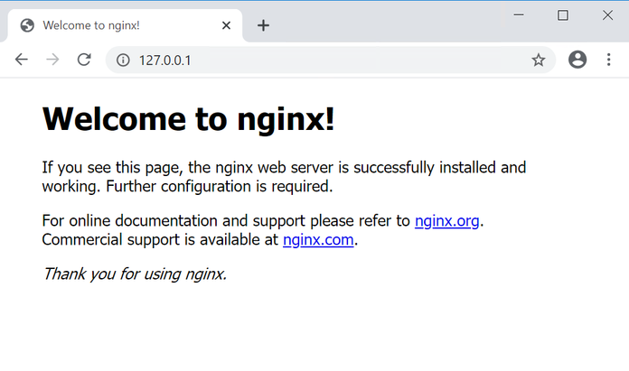

## Lab 2: Deploy your first Pod (Stateless)

A `Pod` is a collection of containers sharing a network and mount namespace and is the basic unit of deployment in Kubernetes. All containers in a `Pod` are scheduled on the same node. In our first demo we will deploy a stateless application that has no persistent storage attached. Without persistent storage, any modifications done to the application will be lost if that application is stopped or deleted.

Here is a sample NGINX webserver deployment.

```markdown
apiVersion: apps/v1
kind: Deployment
metadata:
  labels:
    run: nginx
  name: first-nginx-pod
spec:
  replicas: 1
  selector:
    matchLabels:
      run: nginx-first-pod
  template:
    metadata:
      labels:
        run: nginx-first-pod
    spec:
      containers:
      - image: nginx
        name: nginx
```        

Open a WSL terminal session, if you don't have one open already.


At the prompt, we will start by deploying the NGINX example above, by running:

```markdown
kubectl create -f https://scod.hpedev.io/learn/persistent_storage/yaml/nginx-stateless-deployment.yaml
```

We can see the `Deployment` was successfully created and the NGINX `Pod` is running.

!!! note
    The `Pod` names will be unique to your deployment.

```markdown
$ kubectl get deployments.apps
NAME              READY   UP-TO-DATE   AVAILABLE   AGE
first-nginx-pod   1/1     1            1           38s

$ kubectl get pods
NAME                             READY   STATUS    RESTARTS   AGE
first-nginx-pod-8d7bb985-rrdv8   1/1     Running   0          10s
```

!!! Important
    In a `Deployment`, a `Pod` name is generated using the `Deployment` name and then a randomized hash (i.e. `first-nginx-pod-8d7bb985-kql7t`) to ensure that each `Pod` has a unique name. During this lab exercise, make sure to reference the correct object names that are generated in each exercise.

We can inspect the `Pod` further using the **kubectl describe** command. 

!!! note
    You can use tab completion to help with Kubernetes commands and objects. Start typing the first few letters of the command or Kubernetes object (i.e `Pod`) name and hit **TAB** and it should autofill the name.

```markdown
kubectl describe pod <pod_name> 
```

The output should be similar to this. Note, the `Pod` name will be unique to your deployment.
```markdown
Name:         first-nginx-pod-8d7bb985-rrdv8
Namespace:    default
Priority:     0
Node:         kube-group1/10.90.200.11
Start Time:   Mon, 01 Nov 2021 13:37:59 -0500
Labels:       pod-template-hash=8d7bb985
              run=nginx-first-pod
Annotations:  cni.projectcalico.org/podIP: 192.168.162.9/32
              cni.projectcalico.org/podIPs: 192.168.162.9/32
Status:       Running
IP:           192.168.162.9
IPs:
  IP:           192.168.162.9
Controlled By:  ReplicaSet/first-nginx-pod-8d7bb985
Containers:
  nginx:
    Container ID:   docker://3610d71c054e6b8fdfffbf436511fda048731a456b9460ae768ae7db6e831398
    Image:          nginx
    Image ID:       docker-pullable://nginx@sha256:644a70516a26004c97d0d85c7fe1d0c3a67ea8ab7ddf4aff193d9f301670cf36
    Port:           <none>
    Host Port:      <none>
    State:          Running
      Started:      Mon, 01 Nov 2021 13:38:06 -0500
    Ready:          True
    Restart Count:  0
    Environment:    <none>
    Mounts:
      /var/run/secrets/kubernetes.io/serviceaccount from kube-api-access-w7sbw (ro)
Conditions:
  Type              Status
  Initialized       True
  Ready             True
  ContainersReady   True
  PodScheduled      True
Volumes:
  kube-api-access-w7sbw:
    Type:                    Projected (a volume that contains injected data from multiple sources)
    TokenExpirationSeconds:  3607
    ConfigMapName:           kube-root-ca.crt
    ConfigMapOptional:       <nil>
    DownwardAPI:             true
QoS Class:                   BestEffort
Node-Selectors:              <none>
Tolerations:                 node.kubernetes.io/not-ready:NoExecute op=Exists for 300s
                             node.kubernetes.io/unreachable:NoExecute op=Exists for 300s
Events:
  Type    Reason     Age    From               Message
  ----    ------     ----   ----               -------
  Normal  Scheduled  5m14s  default-scheduler  Successfully assigned default/first-nginx-pod-8d7bb985-rrdv8 to kube-group1
  Normal  Pulling    5m13s  kubelet            Pulling image "nginx"
  Normal  Pulled     5m7s   kubelet            Successfully pulled image "nginx" in 5.95086952s
  Normal  Created    5m7s   kubelet            Created container nginx
  Normal  Started    5m7s   kubelet            Started container nginx
```

Looking under the "Events" section is a great place to start when checking for issues or errors during `Pod` creation.

At this stage, the NGINX application is only accessible from within the cluster. Use `kubectl port-forward` to expose the `Pod` temporarily outside of the cluster to your workstation.

```markdown
kubectl port-forward <pod_name> 80:80
```

The output should be similar to this:
```markdown
kubectl port-forward first-nginx-pod-8d7bb985-rrdv8 80:80
Forwarding from 127.0.0.1:80 -> 8080
Forwarding from [::1]:80 -> 8080
```

!!! note
    If you have something already running locally on port 80, modify the `port-forward` to an unused port (i.e. 5000:80). `Port-forward` is meant for temporarily exposing an application outside of a Kubernetes cluster. For a more permanent solution, look into Ingress Controllers.

Finally, open a browser and go to **http://127.0.0.1** and you should see the following.



You have successfully deployed your first Kubernetes pod. 

With the `Pod` running, you can log in and explore the `Pod`. 

To do this, open a **second** terminal, by clicking on the WSL terminal icon again. The first terminal should have `kubectl port-forward` still running.


Run:

```markdown
kubectl exec -it <pod_name> -- /bin/bash
```

You can explore the `Pod` and run various commands. Some commands might not be available within the `Pod`. Why would that be?

```markdown
root@first-nginx-pod-8d7bb985-rrdv8:/# df -h
Filesystem               Size  Used Avail Use% Mounted on
overlay                   46G  8.0G   38G  18% /
tmpfs                     64M     0   64M   0% /dev
tmpfs                    1.9G     0  1.9G   0% /sys/fs/cgroup
/dev/mapper/centos-root   46G  8.0G   38G  18% /etc/hosts
shm                       64M     0   64M   0% /dev/shm
tmpfs                    1.9G   12K  1.9G   1% /run/secrets/kubernetes.io/serviceaccount
tmpfs                    1.9G     0  1.9G   0% /proc/acpi
tmpfs                    1.9G     0  1.9G   0% /proc/scsi
tmpfs                    1.9G     0  1.9G   0% /sys/firmware

```

While inside the container, you can also modify the webpage.

```markdown
echo "<h1>Hello from the HPE Storage Hands on Labs</h1>" > /usr/share/nginx/html/index.html
```

Now switch back over to the browser and refresh the page (http://127.0.0.1), you should see the updated changes to the webpage.

Once ready, switch back over to your second terminal, type **exit** to logout of the NGINX container and close that terminal. Back in your original terminal, use **Ctrl+C** to exit the port-forwarding.

Since this is a stateless application, we will now demonstrate what happens if the NGINX `Pod` is lost. 

To do this, simply delete the `Pod`.

```markdown
kubectl delete pod <pod_name>
```

Now run `kubectl get pods` to see that a new NGINX `Pod` has been created.

Lets use `kubectl port-forward` again to look at the NGINX application.

```markdown
kubectl port-forward <new_pod_name> 80:80
```

Back in your browser, refresh the page (http://127.0.0.1) and you should the webpage has reverted back to its default state.


Back in the terminal, use **Ctrl+C** to exit the port-forwarding and once ready, type **clear** to refresh your terminal.

The NGINX application has reverted back to default because we didn't store the modifications we made to a location that would persist beyond the life of the container. There are many applications where persistence isn't critical (i.e. Google uses stateless containers for your browser web searches) as they perform computations that are either stored into an external database or passed to subsequent processes. 

As mission-critical workloads move into Kubernetes, the need for stateful containers is increasingly important. The following exercises will go through how to provision persistent storage to applications using the HPE CSI Driver for Kubernetes backed by HPE Primera or Nimble Storage.