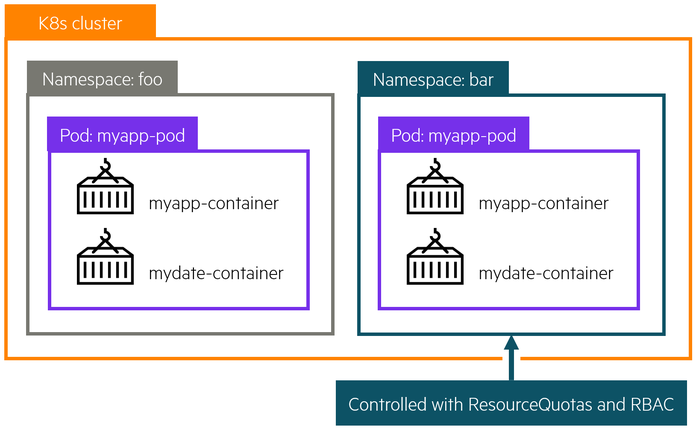

# Overview

This is a free learning resource from HPE which walks you through various exercises to get you familiar with Kubernetes and provisioning Persistent storage using HPE Nimble Storage and HPE Primera storage systems. This guide is by no means a comprehensive overview of the capabilities of Kubernetes but rather a getting started guide for individuals who wants to learn how to use Kubernetes with persistent storage.

[TOC]

    

## Kubernetes cluster

In Kubernetes, nodes within a cluster pool together their resources (memory and CPU) to distribute workloads. A cluster is comprised of control plane and worker nodes that allow you to run your containerized workloads.

##### Control plane

The Kubernetes control plane is responsible for maintaining the desired state of your cluster. When you interact with Kubernetes, such as by using the `kubectl` command-line interface, you’re communicating with your cluster’s Kubernetes API services running on the control plane. Control plane refers to a collection of processes managing the cluster state. 

##### Nodes

Kubernetes runs your workload by placing containers into `Pods` to run on **Nodes**. A node may be a virtual or physical machine, depending on the cluster. Each node is managed by the control plane and contains the services necessary to run `Pods`.

## Kubernetes Objects 

Programs running on Kubernetes are packaged as containers which can run on Linux or Windows. A container image is a lightweight, standalone, executable package of software that includes everything needed to run an application: code, runtime, system tools, system libraries and settings.

##### Pods

A `Pod` is the basic execution unit of a Kubernetes application–the smallest and simplest unit in the Kubernetes object model that you create or deploy. A `Pod` encapsulates an application’s container (or, in some cases, multiple containers), storage resources, a unique network IP, and options that govern how the container(s) should run.

##### Persistent Volumes

Because programs running on your cluster aren’t guaranteed to run on a specific node, data can’t be saved to any arbitrary place in the file system. If a program tries to save data to a file for later, but is then relocated onto a new node, the file will no longer be where the program expects it to be.

To store data permanently, Kubernetes uses a `PersistentVolume`. Local, external storage via SAN arrays, or cloud drives can be attached to the cluster as a `PersistentVolume`.

##### Namespaces
    
Kubernetes supports multiple virtual clusters backed by the same physical cluster. These virtual clusters are called `Namespaces`. `Namespaces` are intended for use in environments with many users spread across multiple teams, or projects. `Namespaces` are a way to divide cluster resources between multiple users.

##### Deployments
A `Deployment` provides declarative updates for `Pods`. You declare a desired state for your `Pods` in your `Deployment` and Kubernetes will manage it for you automatically.

##### Services
A Kubernetes `Service` object defines a policy for external clients to access an application within a cluster. By default, the container runtime uses host-private networking, so containers can talk to other containers only if they are on the same machine. In order for containers to communicate across nodes, there must be allocated ports on the machine’s own IP address, which are then forwarded or proxied to the containers. Coordinating port allocations is very difficult to do at scale, and exposes users to cluster-level issues outside of their control. Kubernetes assumes that `Pods` can communicate with other `Pods`, regardless of which host they land on. Kubernetes gives every `Pod` its own cluster-private IP address, through a Kubernetes Service object, so you do not need to explicitly create links between `Pods` or map container ports to host ports. This means that containers within a `Pod` can all reach each other’s ports on localhost, and all `Pods` in a cluster can see each other without NAT.